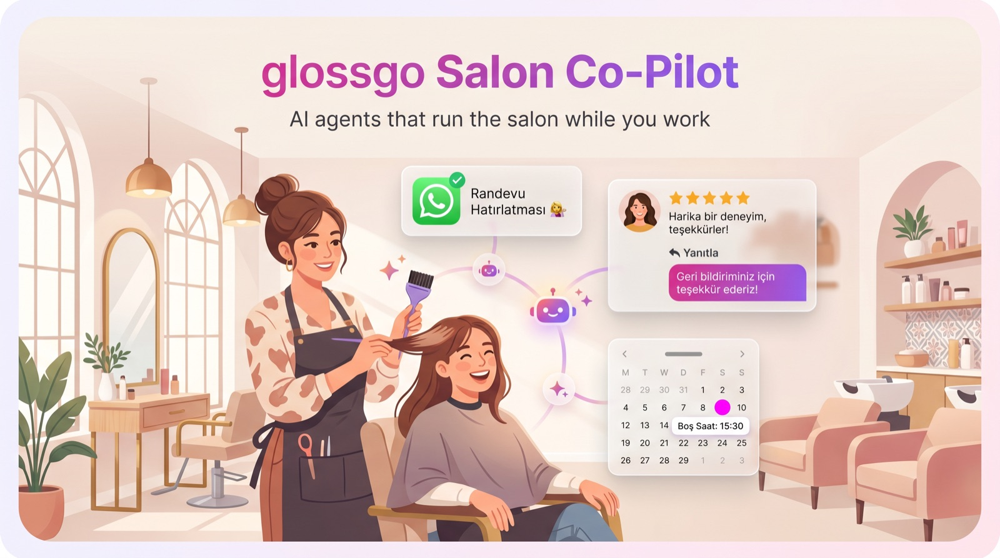
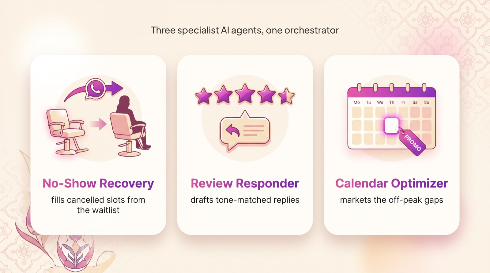
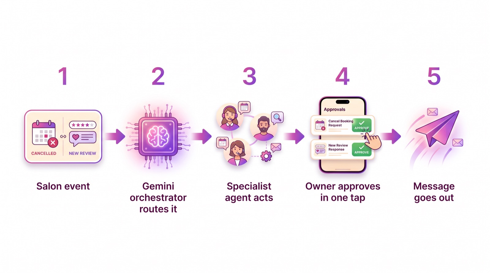
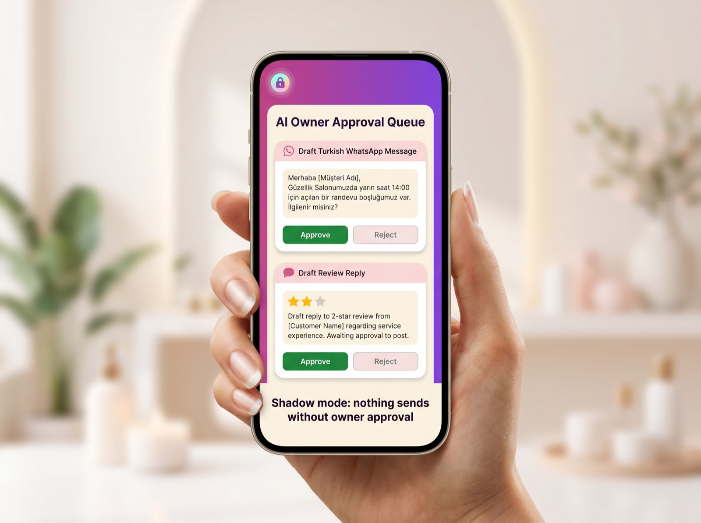

# glossgo Salon Co-Pilot

> Autonomous multi-agent system that runs a beauty salon's marketing,
> reviews, and waitlist matching while the owner is busy.
> **Submission for the Google for Startups AI Agents Challenge, Track 1 (Build).**



[](docs/architecture.mmd)

## Live now

| Surface | URL |
|---|---|
| Orchestrator (POST `/event`) | https://copilot-orchestrator-kpaxfhhqdq-ez.a.run.app |
| Owner dashboard (cookie session) | https://copilot-orchestrator-kpaxfhhqdq-ez.a.run.app/dashboard/login |
| Observability rollups | https://copilot-orchestrator-kpaxfhhqdq-ez.a.run.app/dashboard/stats |
| Liveness probe (public) | https://copilot-orchestrator-kpaxfhhqdq-ez.a.run.app/ready |

Demo tokens are shared with Devpost judges via the participant DM.

## What it does

When something happens at a salon (a customer cancels, a Google review
drops, the next week is suddenly empty), an orchestrator agent routes
the event to a specialist sub-agent that takes autonomous action via
Model Context Protocol (MCP) tools.



| Trigger | Sub-agent | Action | Live wall clock |
|---|---|---|---|
| `booking.cancelled` | No-Show Recovery | Pick best waitlist match (50-30-20 service / time / loyalty), draft personalized Turkish WhatsApp, shadow-mode send | **28 s** |
| `review.created` (2★) | Review Responder | Empathetic Turkish reply, push to owner approval queue | **17 s** |
| `review.created` (5★) | Review Responder | Thankful reply + come-back invite, push to queue | **12 s** |
| `calendar.weekly_review` | Calendar Optimizer | Find the biggest off-peak gap, draft promo + audience tag | **4 s** (refuses to invent on empty schedule) |



Shadow mode is on by default, so every action lands as an owner-approved draft, never an automatic send:




## Stack

- **Agent framework** — [Google Agent Development Kit 2.1](https://google.github.io/adk-docs/) (Python)
- **Foundation model** — Gemini 2.5 Flash on Vertex AI (orchestrator + sub-agents)
- **Tool protocol** — 3 standalone [Model Context Protocol](https://modelcontextprotocol.io/) servers (TypeScript, Streamable HTTP + stdio dual transport)
- **Hosting** — Cloud Run × 4 services, europe-west4
- **Secret management** — Google Secret Manager, no `.env` in the repo
- **Data** — Isolated `copilot` schema on the existing glossgo Supabase project
- **Owner UI** — FastAPI `/dashboard` with HMAC-signed cookie session + CSRF nonce + Origin pin
- **Observability** — `print(flush=True)` tracing per agent action → Cloud Logging (Vertex AI Agent Engine traces are Day 6 work)

## Repo layout

```
apps/
  orchestrator/                    # ADK root agent + FastAPI HTTP entry (Python)
    orchestrator/sub_agents/       # No-Show Recovery + Review Responder + Calendar Optimizer
    main.py                        # POST /event, /dashboard, /dashboard/login, /dashboard/demo, /dashboard/{id}/approve, /ready
  mcp-data/                        # MCP server — read-only Supabase via supabase-js
  mcp-comms/                       # MCP server — WhatsApp + owner approval queue (shadow-mode by default)
  mcp-calendar/                    # MCP server — booking writes (idempotency_key)
docs/
  judges-guide.md                  # Devpost write-up (paste-able by section)
  architecture.mmd                 # Mermaid source for the diagram above
  SECURITY.md                      # Trust model + 6 gaps + fix plan per gap
  sprint-log.md                    # Daily progress notes — every bug + fix, in order
  deploy.md                        # Cloud Run deploy recipe
  img/                             # architecture.png + dashboard.png
scripts/
  run-local.sh                     # Boots orchestrator (stdio MCP) against Doppler secrets
  deploy-cloudrun.sh               # Idempotent rebuild + redeploy of all 4 services
```

## Judges' 4-curl quickstart

```bash
ORCH=https://copilot-orchestrator-kpaxfhhqdq-ez.a.run.app
WB=<webhook-bearer-from-devpost>   # ask the team if you can't find it

# 1) Liveness
curl -sS "$ORCH/ready"

# 2) Trigger No-Show Recovery → Zeynep Kaya match + Turkish draft (~28 s)
curl -sS -X POST "$ORCH/event" \
  -H "Authorization: Bearer $WB" \
  -H 'Content-Type: application/json' \
  -d '{"type":"booking.cancelled",
       "business_id":"11111111-0000-0000-0000-000000000001",
       "booking_id":"55555555-0000-0000-0000-000000000001"}'

# 3) Trigger Review Responder on a seeded 2★ review (~17 s)
curl -sS -X POST "$ORCH/event" \
  -H "Authorization: Bearer $WB" \
  -H 'Content-Type: application/json' \
  -d '{"type":"review.created",
       "business_id":"11111111-0000-0000-0000-000000000001",
       "review_id":"77777777-0000-0000-0000-000000000003"}'

# 4) Open the dashboard, log in, click "Trigger demo" — fires all 3 in parallel
#    https://copilot-orchestrator-kpaxfhhqdq-ez.a.run.app/dashboard/login
```

## Local quickstart (no GCP needed)

Boots the orchestrator with each MCP server as a `node` stdio subprocess.

```bash
git clone https://github.com/GlossGo/glossgo-salon-copilot
cd glossgo-salon-copilot
pnpm install && pnpm -r build

cd apps/orchestrator
python3 -m venv .venv && source .venv/bin/activate
pip install -r requirements.txt
cd ../..

export GOOGLE_API_KEY=<your-gemini-api-key>
export SUPABASE_URL=https://<your-project>.supabase.co
export SUPABASE_SERVICE_ROLE_KEY=<your-key>
./scripts/run-local.sh

# In another terminal:
WB=$(grep COPILOT_WEBHOOK_BEARER /tmp/copilot-* 2>/dev/null | head -1)
curl -X POST http://localhost:8080/event \
  -H "Authorization: Bearer $WB" \
  -H 'Content-Type: application/json' \
  -d '{"type":"booking.cancelled","business_id":"<demo-uuid>","booking_id":"<demo-uuid>"}'
```

## Cloud deploy

```bash
./scripts/deploy-cloudrun.sh        # rebuild + redeploy all 4 services
```

One-time prerequisites + redeploy loop: [`docs/deploy.md`](docs/deploy.md).

## Documentation

- [`docs/judges-guide.md`](docs/judges-guide.md) — Devpost write-up (paste-able)
- [`docs/SECURITY.md`](docs/SECURITY.md) — trust model + 6 gaps + Day 6/7 fix plan
- [`docs/sprint-log.md`](docs/sprint-log.md) — every bug we hit and how we fixed it
- [`docs/architecture.mmd`](docs/architecture.mmd) — Mermaid source for the diagram above
- [`docs/deploy.md`](docs/deploy.md) — Cloud Run deploy recipe

## License

MIT (see [LICENSE](LICENSE))
