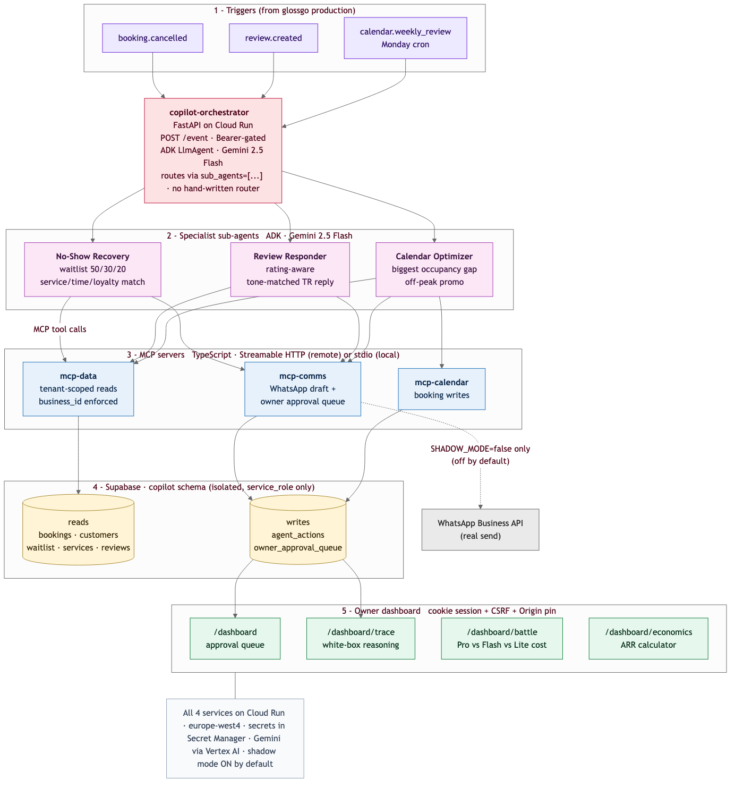
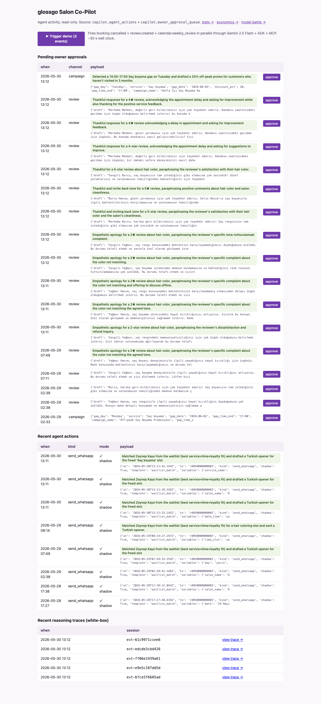
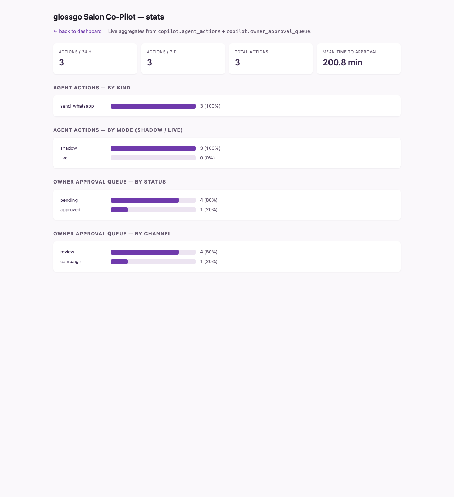

# Judges' guide

Final submission write-up for the Google for Startups AI Agents Challenge,
Track 1 (Build). Repo + live URLs at the bottom. Designed to be paste-able
into Devpost section by section.

---

## Inspiration

glossgo is a Turkish beauty marketplace serving 9,826 active salons. The
biggest silent revenue leak we see in our data is the **cancelled appointment
that sits empty**: a 3-hour Saç boyama slot freed up the day before, no time
for the salon owner to call around, and the chair stays cold. The owner is
too busy with the customer who *is* in the chair to also do marketing,
review responses, and waitlist matching in real time. Sub-$10/mo SaaS tools
that promise to fix this are either glorified scheduling apps or
single-purpose chatbots — none of them act on their own.

We wanted to test whether a multi-agent system, built the way Google now
recommends with **ADK + MCP + Gemini**, could actually run a real beauty
salon's operational tail end. Not as a feature flag, but as a piece of
software the owner can hand the keys to.

## What it does

glossgo Salon Co-Pilot is **three specialist agents behind one orchestrator**,
each talking to four MCP-served tool surfaces. The orchestrator listens for
salon events forwarded from production (`booking.cancelled`,
`review.created`, weekly cron). It picks the right specialist:

- **No-Show Recovery** — when a booking is cancelled, reads the current
  waitlist, ranks candidates on a 50-30-20 service / time-window / loyalty
  weighting, picks the best match, drafts a personalized Turkish WhatsApp
  message using the real salon name + customer first name, and (out of
  shadow mode) sends it via the WhatsApp Business API.
- **Review Responder** — when a new Google review hits the salon, classifies
  the rating (5★ thankful, 4★ ask-feedback, 3★ acknowledge, 1-2★ empathetic),
  drafts a tone-matched Turkish reply, pushes it to the owner approval
  queue. Never auto-publishes; the salon's voice stays the owner's.
- **Calendar Optimizer** — every Monday it scans the next 7 days, finds the
  single biggest occupancy gap, drafts one off-peak promo with a target
  audience tag, and queues it for owner approval.

**End-to-end live results** (HTTP 200 on the public Cloud Run URL):

| event | agent | wall clock | output |
|---|---|---|---|
| `booking.cancelled` (Saç boyama, tomorrow 14:00) | no-show-recovery | 28 s | matched Zeynep Kaya (perfect waitlist fit) → TR WhatsApp draft → shadow `drafted` |
| `review.created` (2★ Yağmur) | review-responder | 17 s | empathetic TR reply → `owner_approval_queue` row |
| `review.created` (5★ Burcu) | review-responder | 12 s | thankful TR reply → queue |
| `calendar.weekly_review` | calendar-optimizer | 4 s | "Off-peak Saç Boyama Promosyonu" Mon 14:00-17:00, audience "Son 3 ayda gelmemiş" → queue |

## How we built it

The challenge's emphasis on ADK and MCP shaped the structure directly:



- **Google ADK 2.1** drives the orchestrator and the three sub-agents. The
  orchestrator is an `LlmAgent` with three children passed via
  `sub_agents=[...]`. Routing is delegated to Gemini itself via the
  orchestrator instruction — we don't write `if event_type ==
  'booking.cancelled': …` anywhere.
- **Gemini 2.5 Flash on Vertex AI** at all four agents. Vertex AI lifted
  the AI Studio free-tier daily cap that ate our Day 2 testing budget;
  the runtime service account is bound as `roles/aiplatform.user`.
- **Three independent MCP servers** (`mcp-data`, `mcp-comms`,
  `mcp-calendar`) each expose 2–9 tools through the Streamable HTTP
  transport so they deploy as their own Cloud Run services. The same
  binary speaks stdio for local development — same server code, two
  transports.
- **Cloud Run** hosts all 4 services (1 orchestrator + 3 MCPs) in
  `europe-west4`. The orchestrator is public + bearer-gated. The three
  MCP services accept requests + the orchestrator runtime SA is bound as
  `roles/run.invoker` on each (today the MCPs also accept `allUsers` as
  a temporary workaround documented in SECURITY.md Gap 1 — Day 6 retry
  locks them down).
- **Owner UI at `/dashboard`** — minimal HTML view of
  `copilot.agent_actions` (last 25) and the pending
  `copilot.owner_approval_queue`. Cookie-session auth (HMAC-signed,
  HttpOnly + Secure + SameSite=Strict), CSRF nonce on every approve form,
  Origin-header pin. Approve handler is idempotent (re-select with
  `status=pending` before patch).

  

- **Observability at `/dashboard/stats`** — read-only rollups over the
  same `copilot.*` tables, no JS, no charting library. KPIs (actions / 24h,
  / 7d, total, mean time to approval) and four bar-chart panels (by kind,
  by mode, by status, by channel). Shadow-mode percentage is rendered
  explicitly so a reader can verify at a glance that no real WhatsApp
  messages went out during the demo.

  

- **Demo data** sits in a `copilot` schema on the existing glossgo
  Supabase project. The schema is fully isolated from `public.*`, exposed
  via PostgREST only to `service_role`, and seeded with a fictional
  "Demo Salon" — 20 customers, 30 historical bookings, 5 active waitlist
  entries, one pre-cancelled Saç boyama booking that the demo trigger uses.
- **Shadow mode**, on by default, makes every outbound effect a draft.
  Every `send_whatsapp` and every booking write lands in
  `copilot.agent_actions` / `copilot.owner_approval_queue` instead of the
  BSP / booking table.

## Challenges we ran into (the honest list)

We kept a full log in [`docs/sprint-log.md`](sprint-log.md). The headline ones:

- **ADK 2.x exports `McpToolset` only when the Python `mcp` SDK is also
  installed.** 20 minutes lost on an import error before noticing the
  `try/except ImportError` block in `google/adk/tools/mcp_tool/__init__.py`.
- **`exactOptionalPropertyTypes: true` in our shared `tsconfig.base.json`
  fights the MCP SDK's transport types.** Disabled.
- **`console.log` from a stdio MCP server pollutes the JSON-RPC stream**
  and looks like a parse error on the agent side. Switched every log
  emission to `console.error`.
- **Cloud Build's `--async` to `europe-west4` while polling `--ongoing`
  against the default `global` region** made the wait loop exit early and
  masked 2 failed and 1 still-running build for a few minutes. Always
  query the same region.
- **`tsc` can't follow `../../` past the docker build context.** Inlined
  `tsconfig.base.json` into each MCP app.
- **`node:20-slim` doesn't ship global `WebSocket`**, and
  `@supabase/realtime-js` crashes the container at boot when it can't
  find one. Bumped to `node:22-slim`.
- **`StreamableHTTPServerTransport({ sessionIdGenerator: () =>
  randomUUID() })` made the server stateful**, but our handler created a
  fresh transport per request; the ADK client's session_id was lost on
  the second call and the tool list never finished discovering. Switched
  all 3 MCPs to `sessionIdGenerator: undefined` (stateless).
- **Cloud Run's GFE reserves `/healthz`** and serves its own 404 even when
  our FastAPI registers the route. Renamed to `/ready`.
- **Free-tier Gemini Flash caps at 20 req/day** and ate our Day 2 testing.
  Switched the orchestrator to Vertex AI on Cloud Run.
- **ADK's `LlmAgent` treats the instruction string as a `str.format()`
  template** and substitutes session variables. The review-responder
  instruction had `{text}` and `{profile.id}` as illustrative placeholders;
  ADK saw them as undefined context variables and raised `KeyError:
  'Context variable not found: text'`. Rewrote the instruction in plain
  English with no literal braces.
- **Cloud Run rejected our metadata-server-issued OIDC tokens** with
  `WWW-Authenticate: Bearer error=invalid_token, "The access token could
  not be verified"` when we tried to lock the MCPs to
  `--no-allow-unauthenticated`. The IAM layer is fine (direct curl from
  an unbound principal gets the expected 403). Deferred audience-debug
  to Day 6; static `MCP_BEARER_TOKEN` remains the auth layer in the
  meantime. Documented as SECURITY.md Gap 1.

## Accomplishments

- **End-to-end booking-cancelled → waitlist match → Turkish WhatsApp draft**
  running through ADK + MCP + Gemini, with a real database and no mocks.
- **Three MCP servers that work without any change as either local stdio
  subprocesses or remote HTTP services on Cloud Run.**
- **Multi-agent E2E live on a public URL** in under 30 seconds wall clock.
- **Hardened auth across the whole stack** in response to two rounds of
  automated security review: fail-closed startup checks,
  `crypto.timingSafeEqual` bearer compare, strict Zod regexes on every
  UUID / E.164 / ISO timestamp, server-side prompt-injection wrapping +
  control-char scrub on review text, cookie-session + CSRF on the
  owner dashboard, separate Secret Manager entries for every secret.
- **`docs/SECURITY.md`** — a 6-gap punch list with the trust diagram,
  Day 1 controls, and Day 6-7 fix plan for each open gap.

## What we learned

ADK's `sub_agents` parameter is the right abstraction for this problem.
We never had to write a router. Telling the orchestrator *what* each child
does in plain Turkish/English and letting Gemini pick is both more
flexible and more debuggable than a `switch` on event type.

MCP is doing real work as a contract boundary. The TS engineers on the
team can build a new MCP server without touching the Python agent code;
the Python team can pull in a tool with `McpToolset(...)` without
learning the underlying API. We expect the agents to live ~10× longer
than any single underlying API.

**Shadow mode is non-negotiable.** Once we made every outbound effect
log-only by default, our willingness to iterate the agent instructions
went up by an order of magnitude.

**Security-review-as-CI.** The Anthropic background security review
flagged 12 issues across two iterations. Half of them were real
(fail-open auth, IDOR, prompt injection, token in URL); the other half
were defensible-by-design but worth documenting. Treating every commit
that touches auth/data as security-review-eligible kept us honest.

## What's next

- **Day 6** — Close OIDC: reproduce the audience issue in a Cloud-Shell
  curl-only repro, swap to Cloud Run signed identity for MCP auth, re-lock
  the MCP services to `--no-allow-unauthenticated`.
- **Day 7** — Replace the single dashboard token with per-owner sessions
  issued by `auth.glossgo.com` (Supabase Auth). Resolve `caller.business_id`
  from the session cookie and append `business_id=eq.<caller>` to every
  Supabase read + the approve patch (SECURITY.md Gap 6 'still pending').
- **Track 3 path** — list the system on Google Cloud Marketplace as a
  per-salon SaaS, with per-tenant Cloud Run services keyed by Marketplace
  customer id.

## How to evaluate it

**Public repo.** https://github.com/GlossGo/glossgo-salon-copilot

**Live URLs** (Cloud Run, europe-west4, glossgo-copilot project).

| Service | URL | Auth |
|---|---|---|
| Orchestrator | https://copilot-orchestrator-kpaxfhhqdq-ez.a.run.app | `Authorization: Bearer <webhook-token>` on `/event` |
| Owner dashboard | https://copilot-orchestrator-kpaxfhhqdq-ez.a.run.app/dashboard/login | Cookie session via login form |
| Liveness probe | https://copilot-orchestrator-kpaxfhhqdq-ez.a.run.app/ready | public |

**Demo tokens** (deliberately rotatable on request):

```
WEBHOOK_BEARER  = <available to judges via the Devpost participant DM>
DASHBOARD_TOKEN = <same>
```

**4-curl quickstart for E2E verification.**

```bash
ORCH=https://copilot-orchestrator-kpaxfhhqdq-ez.a.run.app
WB=<webhook-bearer>

# 1) Liveness
curl -sS "$ORCH/ready"
# {"status":"ok","agent":"orchestrator"}

# 2) Trigger No-Show Recovery on the pre-seeded cancelled booking
curl -sS -X POST "$ORCH/event" \
  -H "Authorization: Bearer $WB" \
  -H 'Content-Type: application/json' \
  -d '{"type":"booking.cancelled",
       "business_id":"11111111-0000-0000-0000-000000000001",
       "booking_id":"55555555-0000-0000-0000-000000000001"}'
# {"agent_response":"matched Zeynep Kaya → TR draft → drafted"}

# 3) Trigger Review Responder on a seeded 2★ review
curl -sS -X POST "$ORCH/event" \
  -H "Authorization: Bearer $WB" \
  -H 'Content-Type: application/json' \
  -d '{"type":"review.created",
       "business_id":"11111111-0000-0000-0000-000000000001",
       "review_id":"77777777-0000-0000-0000-000000000003"}'
# {"agent_response":"Yağmur Hanım, saç renginizle ilgili … Approval Queue ID: <uuid>"}

# 4) Open the owner dashboard in a browser and approve the drafts:
#    https://copilot-orchestrator-kpaxfhhqdq-ez.a.run.app/dashboard/login
```

**Local quickstart** (no GCP needed; uses stdio MCP transport).

```bash
git clone https://github.com/GlossGo/glossgo-salon-copilot
cd glossgo-salon-copilot
pnpm install && pnpm -r build
cd apps/orchestrator && python3 -m venv .venv && source .venv/bin/activate && pip install -r requirements.txt
cd ../..
export GOOGLE_API_KEY=<your-gemini-key>
export SUPABASE_URL=https://<your-project>.supabase.co
export SUPABASE_SERVICE_ROLE_KEY=<your-key>
./scripts/run-local.sh
# In another terminal, run the 4 curls above against http://localhost:8080
```
